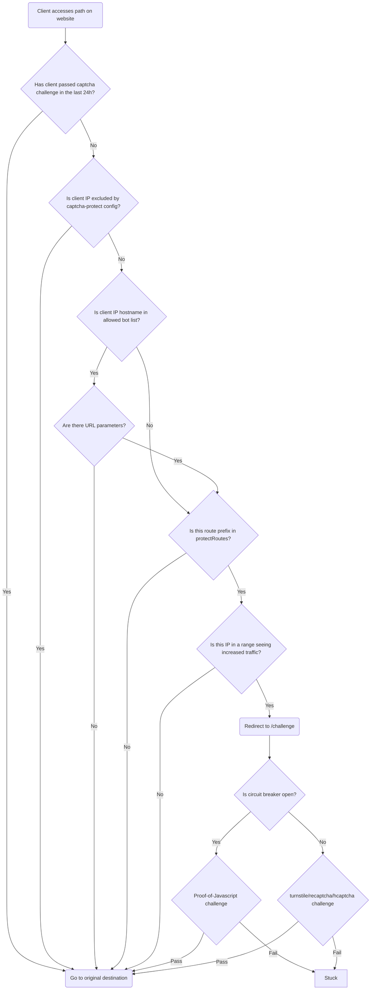

# Captcha Protect
[](https://github.com/libops/captcha-protect/actions/workflows/lint-test.yml)
[](https://goreportcard.com/report/github.com/libops/captcha-protect)
[](https://codecov.io/gh/libops/captcha-protect)

Traefik middleware to challenge individual IPs in a subnet when traffic spikes are detected from that subnet, using a captcha of your choice for the challenge (turnstile, recaptcha, or hcaptcha). **Requires traefik `v2.11.1` or above**

You may have seen CAPTCHAs added to individual forms on the web to prevent bots from spamming submissions. This plugin extends that concept to your entire site (or specific routes on your site), effectively placing your entire site behind a CAPTCHA. However, the CAPTCHA is only triggered when a spike in traffic is detected from the same IP subnet. Once the CAPTCHA is successfully completed, that IP is no longer challenged, allowing uninterrupted browsing.

<details><summary>anti-bot decision tree</summary>


</details>

## Config

### Example

Below is an example `docker-compose.yml` with traefik as the frontend, and nginx as the backend. nginx is adding the captcha-protect plugin as middleware to protect routes on the site that start with `/` (`protectRoutes: "/"`)

Since these config values are specified:

```
rateLimit: 0
window: 864000
```

Any individual IP would immediately be challenged. Once the client at that IP passes a challenge they won't be challenged again for 10 days (86400**0**). This is the recommended default given the wide network range of some abusive crawlers.

```yaml
networks:
    default:
services:
    nginx:
        image: nginx:${NGINX_TAG}
        labels:
            traefik.enable: true
            traefik.http.routers.nginx.entrypoints: http
            traefik.http.routers.nginx.service: nginx
            traefik.http.routers.nginx.rule: Host(`${DOMAIN}`)
            traefik.http.services.nginx.loadbalancer.server.port: 80
            traefik.http.routers.nginx.middlewares: captcha-protect@docker
            traefik.http.middlewares.captcha-protect.plugin.captcha-protect.rateLimit: 0
            traefik.http.middlewares.captcha-protect.plugin.captcha-protect.ipv4subnetMask: 8
            traefik.http.middlewares.captcha-protect.plugin.captcha-protect.window: 864000
            traefik.http.middlewares.captcha-protect.plugin.captcha-protect.protectRoutes: "/"
            traefik.http.middlewares.captcha-protect.plugin.captcha-protect.captchaProvider: turnstile
            traefik.http.middlewares.captcha-protect.plugin.captcha-protect.siteKey: ${TURNSTILE_SITE_KEY}
            traefik.http.middlewares.captcha-protect.plugin.captcha-protect.secretKey: ${TURNSTILE_SECRET_KEY}
            traefik.http.middlewares.captcha-protect.plugin.captcha-protect.goodBots: apple.com,archive.org,commoncrawl.org,duckduckgo.com,facebook.com,google.com,instagram.com,kagibot.org,linkedin.com,msn.com,openalex.org,twitter.com,x.com
            traefik.http.middlewares.captcha-protect.plugin.captcha-protect.persistentStateFile: /tmp/state.json
            traefik.http.middlewares.captcha-protect.plugin.captcha-protect.enableStateReconciliation: "false"
            traefik.http.middlewares.captcha-protect.plugin.captcha-protect.enableGooglebotIPCheck: "true"
            traefik.http.middlewares.captcha-protect.plugin.captcha-protect.periodSeconds: 30
            traefik.http.middlewares.captcha-protect.plugin.captcha-protect.failureThreshold: 3
        networks:
            default:
                aliases:
                  - nginx
    traefik:
        image: traefik:${TRAEFIK_TAG}
        command: >-
            --api.insecure=false
            --api.dashboard=false
            --api.debug=false
            --ping=true
            --entryPoints.http.address=:80
            --providers.docker=true
            --providers.docker.network=default
            --experimental.plugins.captcha-protect.modulename=github.com/libops/captcha-protect
            --experimental.plugins.captcha-protect.version=v1.12.0
        volumes:
            - /var/run/docker.sock:/var/run/docker.sock:z
            - /CHANGEME/TO/A/HOST/PATH/FOR/STATE/FILE:/tmp/state.json:rw
        ports:
            - "80:80"
        networks:
            default:
                aliases:
                    - traefik
        healthcheck:
            test: traefik healthcheck --ping
        depends_on:
            nginx:
                condition: service_started
```
### Config options

| **Parameter**           | **Type (Required)**     | **Default**              | **Description**                                                                                                                                                                                  |
|-------------------------|-------------------------|--------------------------|--------------------------------------------------------------------------------------------------------------------------------------------------------------------------------------------------|
| `mode`                  | `string`                | `prefix`                 | Must be: `prefix`, `suffix`, `regex`. Matching does not include query parameters. `excludeRoutes` always uses `prefix` except when `mode: regex`. Only use `regex` when needed                   |
| `protectRoutes`         | `[]string` (required)   | `""`                     | Comma-separated list of route prefixes/suffixes/regex patterns to protect.                                                                                                                       |
| `excludeRoutes`         | `[]string`              | `""`                     | Comma-separated list of route prefixes to **never** protect. e.g., `protectRoutes: "/"` protects the entire site. `excludeRoutes: "/ajax"` would never challenge any route starting with `/ajax` |
| `captchaProvider`       | `string` (required)     | `""`                     | The captcha type to use. Supported values: `turnstile`, `hcaptcha`, `recaptcha`, and `poj` (proof-of-javascript).                                                                                |
| `siteKey`               | `string` (required)     | `""`                     | The captcha site key.                                                                                                                                                                            |
| `secretKey`             | `string` (required)     | `""`                     | The captcha secret key.                                                                                                                                                                          |
| `periodSeconds`         | `int`                   | `0`                      | Health check interval (in seconds) for the primary captcha provider. The circuit breaker uses this to detect provider outages.                                                                   |
| `failureThreshold`      | `int`                   | `0`                      | Number of consecutive health check failures before the circuit breaker opens and switches to proof-of-javascript fallback.                                                                       |
| `rateLimit`             | `uint`                  | `20`                     | Maximum requests allowed from a subnet before a challenge is triggered.                                                                                                                          |
| `window`                | `int`                   | `86400`                  | Duration (in seconds) for monitoring requests per subnet.                                                                                                                                        |
| `ipv4subnetMask`        | `int`                   | `16`                     | CIDR subnet mask to group IPv4 addresses for rate limiting.                                                                                                                                      |
| `ipv6subnetMask`        | `int`                   | `64`                     | CIDR subnet mask to group IPv6 addresses for rate limiting.                                                                                                                                      |
| `ipForwardedHeader`     | `string`                | `""`                     | Header to check for the original client IP if Traefik is behind a load balancer.                                                                                                                 |
| `ipDepth`               | `int`                   | `0`                      | How deep past the last non-exempt IP to fetch the real IP from `ipForwardedHeader`. Default 0 returns the last IP in the forward header                                                          |
| `goodBots`              | `[]string` (encouraged) | *see below*              | List of second-level domains for bots that are never challenged or rate-limited.                                                                                                                 |
| `enableGooglebotIPCheck`| `string`.               | `"false"`                | Treat IPs coming from googlebot's known IP ranges as good bots                                                                                                                                   |
| `protectParameters`     | `string`                | `"false"`                | Forces rate limiting even for good bots if URL parameters are present. Useful for protecting faceted search pages.                                                                               |
| `protectFileExtensions` | `[]string`              | `""`                     | Comma-separated file extensions to protect. By default, your protected routes only protect html files. This is to prevent files like CSS/JS/img from tripping the rate limit.                    |
| `protectHttpMethods`    | `[]string`              | `"GET,HEAD"`             | Comma-separated list of HTTP methods to protect against                                                                                                                                          |
| `exemptIps`             | `[]string`              | `privateIPs`             | CIDR-formatted IPs that should never be challenged. Private IP ranges are always exempt.                                                                                                         |
| `exemptUserAgents`      | `[]string`              | `""`                     | Comma-separated list of case-insensitive user agent **prefixes** to never challenge. e.g. `exemptUserAgents: edge` would never challenge useragents like "Edge/12.4 ..."                         |
| `challengeURL`          | `string`                | `"/challenge"`           | URL where challenges are served. This will override existing routes if there is a conflict. Setting to blank will have the challenge presented on the same page that tripped the rate limit.     |
| `challengeTmpl`         | `string`                | `"./challenge.tmpl.html"`| Path to the Go HTML template for the captcha challenge page.                                                                                                                                     |
| `challengeStatusCode`   | `int`                   | `200`                    | HTTP Response status code to return when serving a challenge                                                                                                                                     |
| `enableStatsPage`       | `string`                | `"false"`                | Allows `exemptIps` to access `/captcha-protect/stats` to monitor the rate limiter.                                                                                                               |
| `logLevel`              | `string`                | `"INFO"`                 | Log level for the middleware. Options: `ERROR`, `WARNING`, `INFO`, or `DEBUG`.                                                                                                                   |
| `persistentStateFile`   | `string`                | `""`                     | File path to persist rate limiter state across Traefik restarts. In Docker, mount this file from the host.                                                                                       |
| `enableStateReconciliation` | `string`            | `"false"`                | When `"true"`, reads and merges disk state before each save to prevent multiple instances from overwriting data. Adds extra I/O overhead. Only enable for multi-instance deployments sharing state. **Performance warning**: Not recommended for sites with >1M unique visitors due to reconciliation overhead (5-8s per cycle at scale). |

### Circuit Breaker (failover if a captcha provider is unavailable)

The circuit breaker provides automatic failover when the primary captcha provider (Turnstile, reCAPTCHA, or hCaptcha) becomes unavailable. When enabled, it:

1. **Enables a liveness probe on the captcha provider**: Periodically sends HEAD requests to the provider's JavaScript file (every `periodSeconds`). Also tracks 5xx errors during server side validation.
2. **Detects failures**: Counts consecutive health check failures
3. **Opens circuit**: After `failureThreshold` consecutive failures, switches to proof-of-javascript fallback
4. **Falls back to PoJ**: Ensures user is loading javascript. Requires revalidating in 1hr
5. **Auto-recovery**: Automatically returns to primary provider when health checks succeed

**Proof-of-Javascript Fallback:**
- Requires browsers to submit a form
- Self-contained (no external dependencies)

**Configuration:**
- Circuit breaker is enabled by setting two config settings: `periodSeconds` and `failureThreshold`
  - e.g. `periodSeconds: 30` and `failureThreshold: 3`
- To disable: set both `periodSeconds: 0` and `failureThreshold: 0` (the default config)
- The `poj` provider can also be used directly as the primary provider (no circuit breaker needed)

### Good Bots

To avoid having this middleware impact your SEO score, it's recommended to provide a value for `goodBots`. By default, no bots will be allowed to crawl your protected routes beyond the rate limit unless their second level domain (e.g. `bing.com`) is configured as a good bot.

A good default value for `goodBots` would be:

```
enableGooglebotIPCheck: "true"
goodBots: apple.com,archive.org,duckduckgo.com,facebook.com,google.com,instagram.com,kagibot.org,linkedin.com,msn.com,openalex.org,twitter.com,x.com
```

Since google publishes their bot IPs, we can also leverage their API to let google crawl the site unchallenged based on client IP. This can be enabled with `enableGooglebotIPCheck: "true"`

**However** if you set the config parameter `protectParameters="true"`, even good bots won't be allowed to crawl protected routes if a URL parameter is on the request (e.g. `/foo?bar=baz`). This `protectParameters` feature is meant to help protect faceted search pages.


## Overriding the challenge template file

You probably will want to theme the CAPTCHA challenge page to match the style of your site.

You can do that by copying the [challenge.tmpl.html](./challenge.tmpl.html) file in this repo into your docker compose project, mounting it into your traefik container

```yaml
    traefik:
        volumes:
            - ./host/path/to/challenge.tmpl.html:/challenge.tmpl.html:ro
```

and pointing the middleware to your overridden template with

```yaml
            traefik.http.middlewares.captcha-protect.plugin.captcha-protect.challengeTmpl: "/challenge.tmpl.html"
```

When you override the challenge template, the process probably looks like:

1. Copying some html file from your existing site (so the challenge looks like the rest of your site)
2. Replacing some `<div>` in the HTML body for the file copied in step 1 with the `<form>...</form><script>...</script>` HTML tags/contents in this repo's default [challenge.tmpl.html](./challenge.tmpl.html). You must copy the `form` and `script` tags exactly as they are in the original challenge template. They use go's templating language to inject the proper site key and other variables into the HTML response when a challenge is presented
3. You must also be sure to have this in the `<head>` of your overridden template:

```
    <script src="{{ .FrontendJS }}" async defer referrerpolicy="no-referrer"></script>
```

## Similar projects

- [Traefik RateLimit middleware](https://doc.traefik.io/traefik/middlewares/http/ratelimit/) - the core traefik ratelimit middleware will start sending 429 responses based on individual IPs, which might not be good enough to protect against traffic coming from distributed networks. Also, this plugin (captcha-protect) allows not including files in your rate limiter to avoid static assets from being counted in the rate limit.
- [crowdsec-bouncer-traefik-plugin](https://github.com/maxlerebourg/crowdsec-bouncer-traefik-plugin) has a captcha option, but requires integrating with crowdsec to verify individual IPs. This plugin (captcha-protect) instead just checks the traffic actually visiting your site and verifies the traffic is from a person only when the traffic exceeds some rate limit you configure.

## Attribution

- the original implementation of this logic was [a drupal module called turnstile_protect](https://www.drupal.org/project/turnstile_protect). This traefik plugin was made to make the challenge logic even more perfomant than that Drupal module, and also to provide this bot protection to non-Drupal websites
- making general captcha structs to support multiple providers was based on the work in [crowdsec-bouncer-traefik-plugin](https://github.com/maxlerebourg/crowdsec-bouncer-traefik-plugin)
- in memory cache thanks to https://github.com/patrickmn/go-cache

## When to enable regex

When possible, you want to keep regex disabled as seen in the example benchmark below.

However, when needed it can be enabled with `mode: regex`

```
$ go mod init bench
$ cat << EOF > bench_test.go
package main

import (
	"regexp"
	"strings"
	"testing"
)

var (
	testPath = "/api/v1/user/profile"
	prefix   = "/api/v1"
	regex    = regexp.MustCompile("^/api/v1")
)

func BenchmarkHasPrefix(b *testing.B) {
	for i := 0; i < b.N; i++ {
		_ = strings.HasPrefix(testPath, prefix)
	}
}

func BenchmarkRegexMatch(b *testing.B) {
	for i := 0; i < b.N; i++ {
		_ = regex.MatchString(testPath)
	}
}
EOF
$ go test -bench=. -benchmem
```

```
goos: darwin
goarch: amd64
cpu: Intel(R) Core(TM) i7-9750H CPU @ 2.60GHz
BenchmarkHasPrefix-12     	340856451	         3.415 ns/op	       0 B/op	       0 allocs/op
BenchmarkRegexMatch-12    	27992568	        41.20 ns/op	       0 B/op	       0 allocs/op
PASS
```


## How to monitor the rate limiter

If you set the `enableStatsPage` to true, it allows `exemptIps` to access /`captcha-protect/stats` to monitor the rate limiter. The key JSON key to look on the stats page is the top level "rate" key, which will list the subnets that are currently forced to be challenged based to request patterns and the `captcha-protect` configuration values used.

If you have use a computer within the `exemptIps`, and access to the command line tools `curl` and `jq`, here is a recipe for how to list the top 25 subnets being challenged...

```bash
curl -s https://example.com/captcha-protect/stats |   jq -r '.rate | to_entries | sort_by(.value) | .[] | "\(.key): \(.value)"' |   tail -25
```

This JSON state data is also found in the `state.json` file that you should have configured in your `docker-compose.yml` using the `persistentStateFile` setting and volume definition. NOTE: this file should only be changed by `captcha-protect` and not manually.

## Troubleshooting

Here is a way to troubleshoot your `captcha-protect` set up.

### Verify that your Turnstile site-key is configured properly

One reason that may cause `captcha-protect` to not work is that the Cloudflare Turnstile widget site-key or private-key are not properly set for `captcha-protect` to access. Below is a way to confirm if the Turnstile site-key is configured correctly. (**WARNING**: There is currently no easy way to check the private-key, since the secret-key should never be displayed on a webpage or shared.)
1. Visit the `captcha-protect` "challenge" URL which is set to `https://example.com/challenge` by default.
1. You should see a web page that says "Verifying connection" 
<br>**NOTE**: If you customized the `challengeTmpl` configuration, the page may say something different.
1. Look at the HTML source code for the page `https://example.com/challenge`, by right-clicking on the page and selecting "View page source" (on Chrome).
1. In the HTML source view that opens up, look for a `<Div>` tag that has an attribute named `data-sitekey`, and check if its value matches your Cloudflare Turnstile widget sitekey value. 
<br>**TIP**: You need to log in to your Cloudflare online account and go to the Turnstile section to see your site-key and secret-key values.
1. If the site-key value did not match in the HTML `<Div>` tag, then update the `docker-compose.yml` and/or `.env` file to correctly pass the site-key value. Also check if the Cloudflare Turnstile widget secret-key is set correctly.
