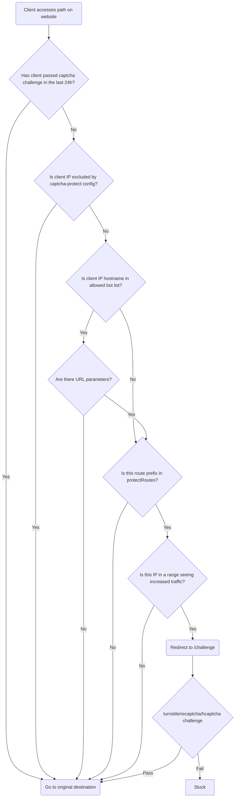

# Captcha Protect
[](https://github.com/libops/captcha-protect/actions/workflows/lint-test.yml)
[](https://goreportcard.com/report/github.com/libops/captcha-protect)

Traefik middleware to challenge individual IPs in a subnet when traffic spikes are detected from that subnet, using a captcha of your choice for the challenge (turnstile, recaptcha, or hcaptcha). **Requires traefik `v2.11.0` or above**

You may have seen CAPTCHAs added to individual forms on the web to prevent bots from spamming submissions. This plugin extends that concept to your entire site (or specific routes on your site), effectively placing your entire site behind a CAPTCHA. However, the CAPTCHA is only triggered when a spike in traffic is detected from the same IP subnet. Once the CAPTCHA is successfully completed, that IP is no longer challenged, allowing uninterrupted browsing.

<details><summary>anti-bot decision tree</summary>


</details>

## Config

### Example

Below is an example `docker-compose.yml` with traefik as the frontend, and nginx as the backend. nginx is using this middleware to protect routes on the site that start with `/` (`protectRoutes: "/"`)

Since the config values aren't specified, captcha-protect would use the default `rateLimit: 20` and `window: 86400` so any IPv4 in `X.Y.0.0/16` (or ipv6 in `/64`) could only access the site 20 times before individual IPs in that subnet are required to pass a captcha to continue browsing.

```yaml
networks:
    default:
services:
    nginx:
        image: nginx:${NGINX_TAG}
        labels:
            traefik.enable: true
            traefik.http.routers.nginx.entrypoints: http
            traefik.http.routers.nginx.service: nginx
            traefik.http.routers.nginx.rule: Host(`${DOMAIN}`)
            traefik.http.services.nginx.loadbalancer.server.port: 80
            traefik.http.routers.nginx.middlewares: captcha-protect@docker
            traefik.http.middlewares.captcha-protect.plugin.captcha-protect.protectRoutes: "/"
            traefik.http.middlewares.captcha-protect.plugin.captcha-protect.captchaProvider: turnstile
            traefik.http.middlewares.captcha-protect.plugin.captcha-protect.siteKey: ${TURNSTILE_SITE_KEY}
            traefik.http.middlewares.captcha-protect.plugin.captcha-protect.secretKey: ${TURNSTILE_SECRET_KEY}
            traefik.http.middlewares.captcha-protect.plugin.captcha-protect.goodBots: apple.com,archive.org,duckduckgo.com,facebook.com,google.com,googlebot.com,googleusercontent.com,instagram.com,kagibot.org,linkedin.com,msn.com,openalex.org,twitter.com,x.com
            traefik.http.middlewares.captcha-protect.plugin.captcha-protect.persistentStateFile: /tmp/state.json
        networks:
            default:
                aliases:
                  - nginx
    traefik:
        image: traefik:${TRAEFIK_TAG}
        command: >-
            --api.insecure=false
            --api.dashboard=false
            --api.debug=false
            --ping=true
            --entryPoints.http.address=:80
            --providers.docker=true
            --providers.docker.network=default
            --experimental.plugins.captcha-protect.modulename=github.com/libops/captcha-protect
            --experimental.plugins.captcha-protect.version=v1.3.2
        volumes:
            - /var/run/docker.sock:/var/run/docker.sock:z
            - /CHANGEME/TO/A/HOST/PATH/FOR/STATE/FILE:/tmp/state.json:rw
        ports:
            - "80:80"
        networks:
            default:
                aliases:
                    - traefik
        healthcheck:
            test: traefik healthcheck --ping
        depends_on:
            nginx:
                condition: service_started
```
### Config options

| **Parameter**           | **Type (Required)**     | **Default**             | **Description**                                                                                                                                                                           |
|-------------------------|-------------------------|-------------------------|-------------------------------------------------------------------------------------------------------------------------------------------------------------------------------------------|
| `protectRoutes`         | `[]string` (required)   | `""`                    | Comma-separated list of route prefixes to protect. e.g., `"/"` protects the entire site (including file/js/css downloads, which you likely don't want). `"/browse"` protects its subtree. |
| `captchaProvider`       | `string` (required)     | `""`                    | The captcha type to use. Supported values: `turnstile`, `hcaptcha`, and `recaptcha`.                                                                                                      |
| `siteKey`               | `string` (required)     | `""`                    | The captcha site key.                                                                                                                                                                     |
| `secretKey`             | `string` (required)     | `""`                    | The captcha secret key.                                                                                                                                                                   |
| `rateLimit`             | `uint`                  | `20`                     | Maximum requests allowed from a subnet before a challenge is triggered.                                                                                                                  |
| `window`                | `int`                   | `86400`                 | Duration (in seconds) for monitoring requests per subnet.                                                                                                                                 |
| `ipv4subnetMask`        | `int`                   | `16`                    | CIDR subnet mask to group IPv4 addresses for rate limiting.                                                                                                                               |
| `ipv6subnetMask`        | `int`                   | `64`                    | CIDR subnet mask to group IPv6 addresses for rate limiting.                                                                                                                               |
| `ipForwardedHeader`     | `string`                | `""`                    | Header to check for the original client IP if Traefik is behind a load balancer.                                                                                                          |
| `ipDepth`               | `int`                   | `0`                     | How deep past the last non-exempt IP to fetch the real IP from `ipForwardedHeader`. Default 0 returns the last IP in the forward header                                                   |
| `goodBots`              | `[]string` (encouraged) | *see below*             | List of second-level domains for bots that are never challenged or rate-limited.                                                                                                          |
| `protectParameters`     | `string`                | `"false"`               | Forces rate limiting even for good bots if URL parameters are present. Useful for protecting faceted search pages.                                                                        |
| `protectFileExtensions` | `[]string`              | `""`                    | Comma-separated file extensions to protect. By default, your protected routes only protect html files. This is to prevent files like CSS/JS/img from tripping the rate limit.             |
| `exemptIps`             | `[]string`              | `privateIPs`            | CIDR-formatted IPs that should never be challenged. Private IP ranges are always exempt.                                                                                                  |
| `challengeURL`          | `string`                | `"/challenge"`          | URL where challenges are served. This will override existing routes if there is a conflict.                                                                                               |
| `challengeTmpl`         | `string`                | `"./challenge.tmpl.html"`| Path to the Go HTML template for the captcha challenge page.                                                                                                                             |
| `enableStatsPage`       | `string`                | `"false"`               | Allows `exemptIps` to access `/captcha-protect/stats` to monitor the rate limiter.                                                                                                        |
| `logLevel`              | `string`                | `"INFO"`                | Log level for the middleware. Options: `ERROR`, `WARNING`, `INFO`, or `DEBUG`.                                                                                                            |
| `persistentStateFile`   | `string`                | `""`                    | File path to persist rate limiter state across Traefik restarts. In Docker, mount this file from the host.                                                                                |


### Good Bots

To avoid having this middleware impact your SEO score, it's recommended to provide a value for `goodBots`. By default, no bots will be allowed to crawl your protected routes beyond the rate limit unless their second level domain (e.g. `google.com`) is configured as a good bot.

A good default value for `goodBots` would be:

```
goodBots: apple.com,archive.org,duckduckgo.com,facebook.com,google.com,googlebot.com,googleusercontent.com,instagram.com,kagibot.org,linkedin.com,msn.com,openalex.org,twitter.com,x.com
```

**However** if you set the config parameter `protectParameters="true"`, even good bots won't be allowed to crawl protected routes if a URL parameter is on the request (e.g. `/foo?bar=baz`). This `protectParameters` feature is meant to help protect faceted search pages.


## Overriding the challenge template file

You probably will want to theme the CAPTCHA challenge page to match the style of your site.

You can do that by copying the [challenge.tmpl.html](./challenge.tmpl.html) file in this repo into your docker compose project, mounting it into your traefik container

```yaml
    traefik:
        volumes:
            - ./host/path/to/challenge.tmpl.html:/challenge.tmpl.html:ro
```

and pointing the middleware to your overridden template with

```yaml
            traefik.http.middlewares.captcha-protect.plugin.captcha-protect.challengeTmpl: "/challenge.tmpl.html"
```

When you override the challenge template, the process probably looks like:

1. Copying some html file from your existing site (so the challenge looks like the rest of your site)
2. Replacing some `<div>` in the HTML body for the file copied in step 1 with the `<form>...</form><script>...</script>` HTML tags/contents in this repo's default [challenge.tmpl.html](./challenge.tmpl.html). You must copy the `form` and `script` tags exactly as they are in the original challenge template. They use go's templating language to inject the proper site key and other variables into the HTML response when a challenge is presented
3. You must also be sure to have this in the `<head>` of your overridden template:

```
    <script src="{{ .FrontendJS }}" async defer referrerpolicy="no-referrer"></script>
```

## Similar projects

- [Traefik RateLimit middleware](https://doc.traefik.io/traefik/middlewares/http/ratelimit/) - the core traefik ratelimit middleware will start sending 429 responses based on individual IPs, which might not be good enough to protect against traffic coming from distributed networks. Also, this plugin (captcha-protect) allows not including files in your rate limiter to avoid static assets from being counted in the rate limit.
- [crowdsec-bouncer-traefik-plugin](https://github.com/maxlerebourg/crowdsec-bouncer-traefik-plugin) has a captcha option, but requires integrating with crowdsec to verify individual IPs. This plugin (captcha-protect) instead just checks the traffic actually visiting your site and verifies the traffic is from a person only when the traffic exceeds some rate limit you configure.

## Attribution

- the original implementation of this logic was [a drupal module called turnstile_protect](https://www.drupal.org/project/turnstile_protect). This traefik plugin was made to make the challenge logic even more perfomant than that Drupal module, and also to provide this bot protection to non-Drupal websites
- making general captcha structs to support multiple providers was based on the work in [crowdsec-bouncer-traefik-plugin](https://github.com/maxlerebourg/crowdsec-bouncer-traefik-plugin)
- in memory cache thanks to https://github.com/patrickmn/go-cache
